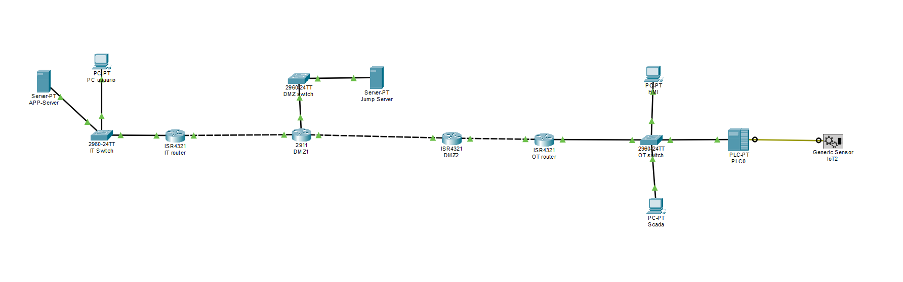

## **OBJETIVE**
The objective of this repository is to simulate OT network segmentation and apply the cybersecurity  knowledge to the industrial area and critical environments using the Purdue Enterprise Reference Architecture. In the industrial sector is crucial make a proper segmentation on the network because the IT and OT Networks must keep separete for security.In the event of an attack by a hacker or cybercriminal, this segmentacion simplifies damage control.

## **IT/OT CONTEXT**
This project simulates a secure network architecture for the energy sector, modeled after industrial companies like Cydsa and Pemex.The simulation implements VLANS based segmentation to isolate IT and OT areas separating each environments and connecting with a Demilitarized zone, Addign a layer of security.By utilizing a combination of industrial switches,firewalls,logical firewalls and dedicated servers, The architecture demonstrates how to protect critical OT assets from external threats while maintaining operations. 

## **IMPLEMENTATION OF CONTROLS**
In this project I implemented some segmentation controls and protection making a segmentation based on routing to create a secure Network architecture in an industrial IT/OT environment. 
The main implementations include:

##### **Network Segmentation in routing**
**192.168.10.0 - IT Network:** corporate network for users and administrative systems 
**192.168.20.0 - DMZ Network:** intermediate zone for services that require communication between IT and OT.
**192.168.30.0 - OT Network:** industrial control network where SCADA systems and field devices reside.

##### **Routing between Networks**
Inter-Networks routing was configured to allow controlled communication between different zones of the Network.

##### **Firewall simulation between Networks**
It apply filtering rules to isolate the diferents Networks and keep separate making configuration ACL on the routers to make a logic firewall and make a segmentation based on IP 

##### **Separation of IT and OT domains**
The IT network remained isolated from the OT network, allowing only specific communications through the DMZ zone.

##### **Topology based on the Purdue model**
The architecture of the laboratory follows principles of the
Purdue Enterprise Reference Architecture to structure the layers of the industrial network.

## **STANDAR AND REFERENCE FRAMES**
Based on NIST SP 800-82 and IEC 62443 standards, this project implements network segmentation in industrial environments. It utilizes level-based isolation and a DMZ following the Purdue Model, adding a robust security layer to the cyber-environment while ensuring a scalable architectural projection.

## **CONCLUTION**
This project reflects knowledge of the standards SP 800-82 and IEC 62443 and how it is their function on Networks on the industrial environment to safeguard our installations on the energy plant or antoher production plans and have a better structure to improve the security on other plants.
