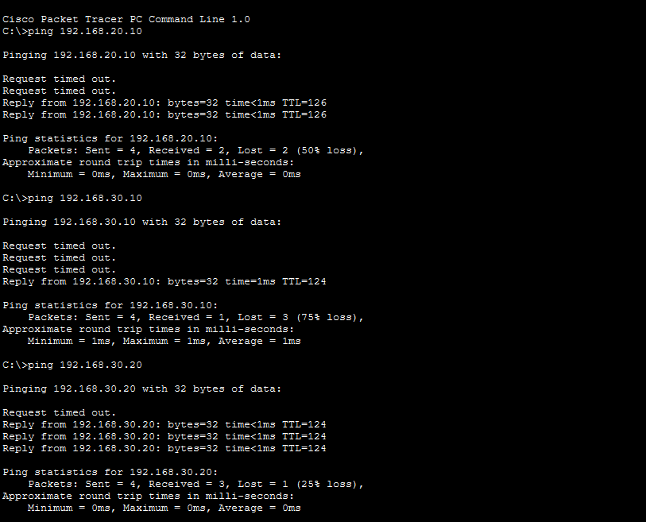
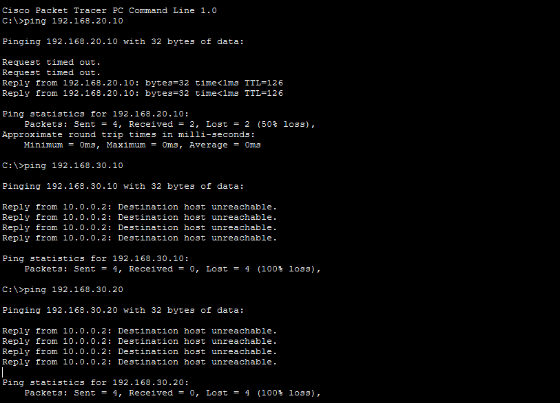

## **IT FIREWALL RULES**
The router uses an ACL configuration to act as a logic firewall, filtering traffic by IP to segment the network. It connects IT with the DMZ while isolating the OT network by adding a security layer.

The router allows users on the **.10.0** network to access port 22 (SSH) on a specific server, while blocking all traffic between the **.10.0** and **.30.0** networks. Any traffic that does not match the previous rules is processed according to the final ACL rule.

	access-list 100 permit tcp 192.168.10.0 0.0.0.255 host 192.168.20.10 eq 22
	access-list 100 deny ip 192.168.10.0 0.0.0.255 192.168.30.0 0.0.0.255
	access-list 100 permit ip any any

## **BEFORE ACL AND VLANS**
##### IT TO HMI,SCADA AND JUMP SERVER

Before implementing ACL rules and VLAN segmentation, all networks were able to communicate without restrictions.Connectivity test show that devices from the IT network could directly reach devices in the OT network.

## **AFTER ACL AND VLANS**
##### IT TO HMI,SCADA AND JUMP SERVER

After implementing ACL rules and VLAN segmentation, inter-VLAN communication has failed.Connectivity tests indicate that devices on the IT network cannot reach devices on the OT network.
