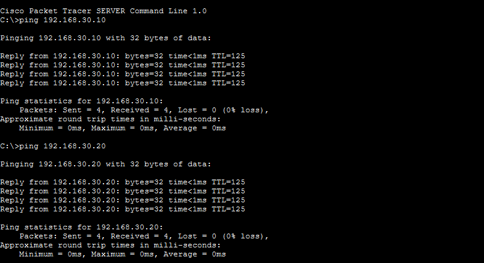
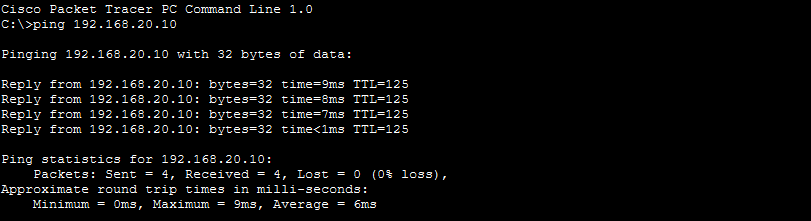
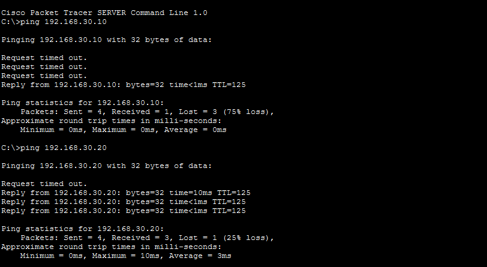
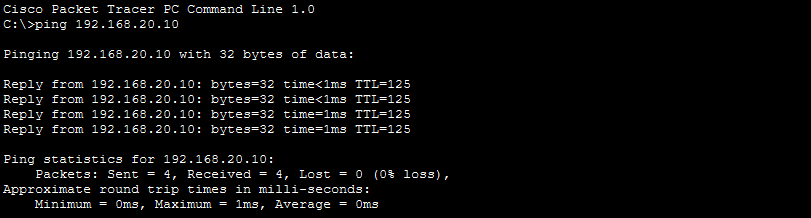

## **OT FIREWALL RULES**
The router utilizes an ACL configuration to function as a logical firewall, filtering traffic by IP to achieve network segmentation. It specifically permits the host 192.168.20.10 to communicate with the OT network, while blocking any other IP address attempting to access that same zone. Furthermore, it ensures that traffic unrelated to the OT network remains unaffected, allowing the IT network to maintain normal operations and access the internet.
	
	access-list 110 permit ip host 192.168.20.10 192.168.30.0 0.0.0.255
	access-list 110 deny ip any 192.168.30.0 0.0.0.255
	access-list 110 permit ip any any

## **BEFORE ACL AND VLANS**

##### JUMP SERVER TO HMI AND SCADA

##### HMI TO JUMP SERVER

Before implementing ACL rules and VLAN segmentation, all networks were able to communicate without restrictions.Connectivity test show that devices from the IT network could directly reach devices in the OT network.

## **AFTER ACL AND VLANS**

##### JUMP SERVER TO HMI AND SCADA

##### HMI TO JUMP SERVER

After implementing ACL rules and VLAN segmentation, inter-VLAN communication has failed.Connectivity tests indicate that devices on the JUMP SERVER network cannot reach devices on the OT network.
