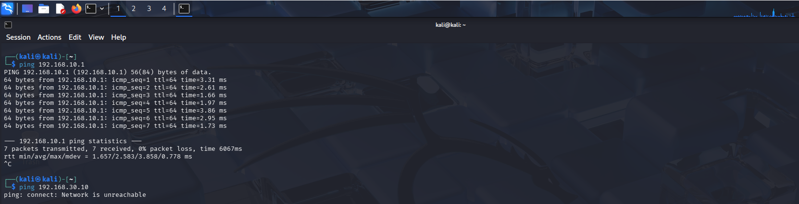
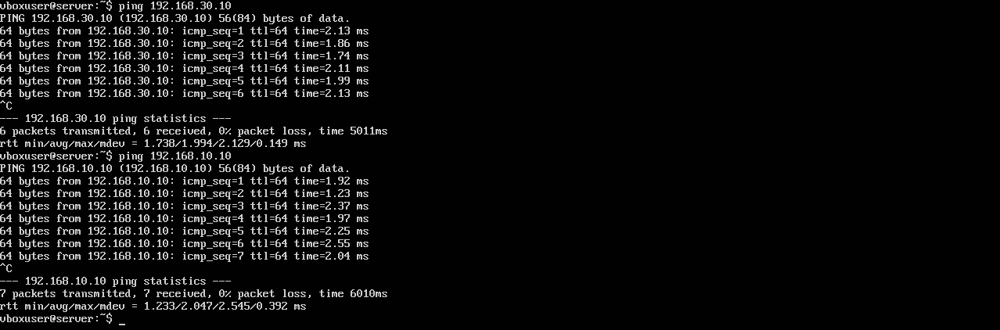
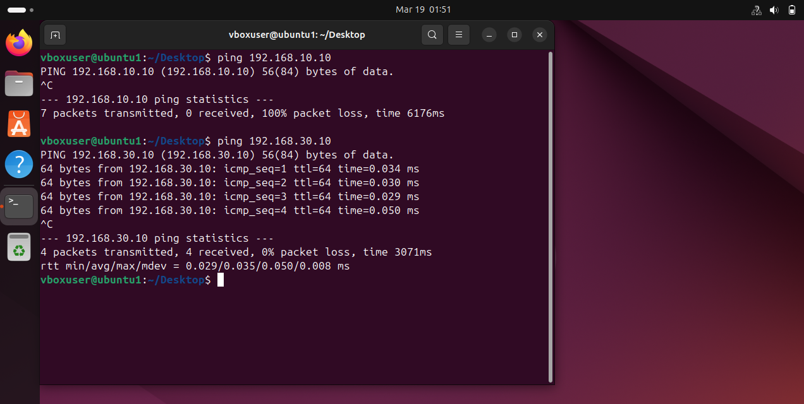

## **TESTING WITH SECURITY RULES**

This project focuses on network segmentation across three distinct areas, each utilizing a different operating system to replicate the network architecture previously designed in Cisco Packet Tracer. The IT zone employs Kali Linux to simulate a specialized security environment. The DMZ is managed by an Ubuntu Server, acting as the gateway, and finally, the HMI/PLC systems are simulated using Ubuntu Desktop to represent the operational layer.

## **IT**

## **DMZ**

## **OT**

## **CONCLUTION**
In conclusion, this project validates the transition from a theoretical Cisco Packet Tracer design to a functional virtualized environment. The use of multiple operating systems allowed us to simulate a heterogeneous network where routing, static IP addressing, and IP forwarding were correctly configured. This setup serves as a scalable laboratory for testing industrial security policies and HMI/PLC communications within a strictly controlled environment.
